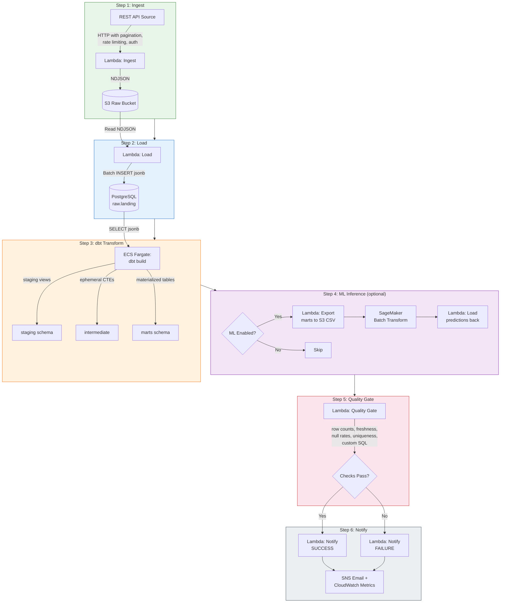
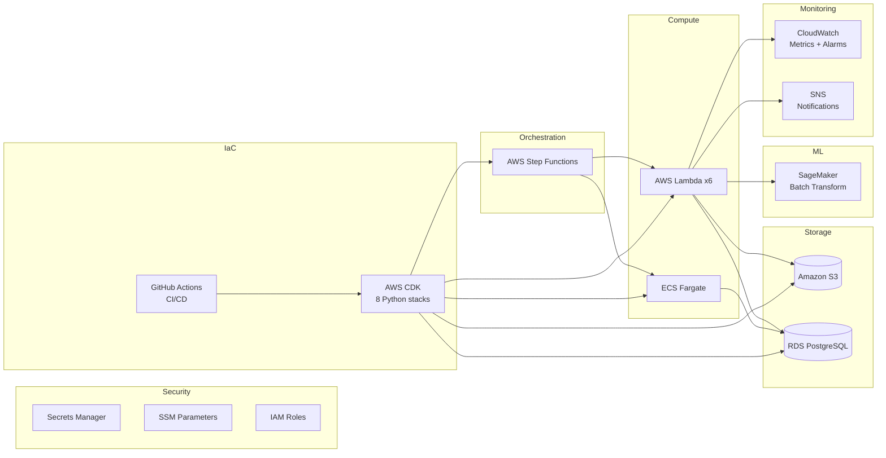
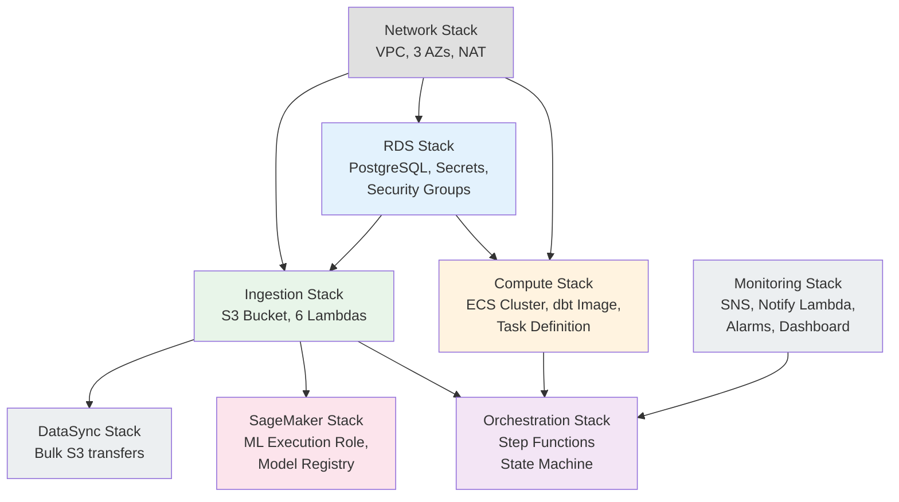

# Architecture

## Pipeline flow

## AWS services map

## CDK stack dependency graph

## Tech stack summary

| Layer | Technology |
|---|---|
| **Infrastructure as Code** | AWS CDK (Python), 8 stacks |
| **Orchestration** | AWS Step Functions |
| **Compute** | AWS Lambda (Python 3.12) + ECS Fargate |
| **Database** | Amazon RDS PostgreSQL 16 (free tier) |
| **Object Storage** | Amazon S3 |
| **Transformation** | dbt Core (dbt-postgres) |
| **ML** | AWS SageMaker (Batch Transform, scikit-learn) |
| **Monitoring** | CloudWatch (EMF metrics, alarms, dashboard) |
| **Notifications** | Amazon SNS |
| **CI/CD** | GitHub Actions (test + synth + deploy) |
| **Secrets** | AWS Secrets Manager + SSM Parameter Store |
